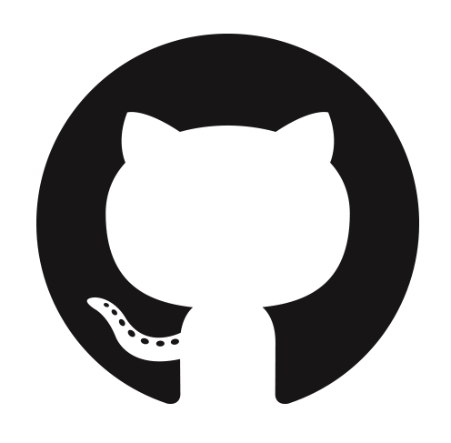

= Baptiste Mathus -- Engineering Leader
:toc: right
:toclevels: 4
:stylesheet: asciidoctor-stylesheet-factory/stylesheets/maker.css
:last-update-label!:

link:en.html[See English Version] <=====fr
link:fr.html[Voir version française] <=====en

[cols="2"]
[frame="none"]
|===
a|
125 Rue Bonnat +
31400 Toulouse, France

41 ans, français, marié, 3 enfants + <=====fr
41 yo, Frog, married, 3 children + <=====en

a|

 
baptiste@mathus.fr +
 
http://batmat.net +
 
link:https://github.com/batmat[batmat] +

link:http://twitter.com/bmathus"[bmathus]

|===

.A propos <=====fr
.About <=====en
****
Je suis un développeur passionné depuis plus de 10 ans. Mon intérêt naturel allant davantage vers les couches applicatives _backend_, je me suis souvent trouvé en situation de travailler sur des solutions techniques, ou de fournir des services destinés aux autres développeurs, et globalement aux profils plus techniques. <=====fr

J'ai travaillé jusqu'en 2010 à la création d'un framework interne de développement _Java EE_ destiné à accélérer les développements (générateur de code MDD + socle technique Java). En parallèle, j'ai initié la mise en place d'une _forge logicielle_ (intégration continue, etc.). Partie de rien, cette infrastructure est aujourd'hui devenue centrale et critique, utilisée quotidiennement par près de 100 personnes, contenant notamment près de 1000 jobs et mettant en oeuvre plus de 20 esclaves (Jenkins). <=====fr

J'ai ensuite été Architecte Technique pendant 3 ans. Je m'occupais de concevoir ou valider des solutions techniques pour les projets en avance de phase. Fin 2012, j'ai eu l'occasion de travailler en équipe à la mise en oeuvre de bout en bout (interception, API développeurs, IHM) de la couche sécurité du nouvel applicatif de l'entreprise.<=====fr

Depuis fin 2014, je travaille à nouveau sur la forge logicielle de l'entreprise. Nous accordons logiquement une importance particulière à automatiser un maximum de choses, et à réduire la friction dans les livraisons à fournir les méthodes et les outils visant à s'approcher du _Continuous Delivery_.<=====fr

J'ai découvert par ailleurs l'agilité en 2010, et m'y suis fortement intéressé depuis. Ayant toujours été intéressé à la fois par le développement et les aspects plus infrastructurels, je m'intéresse aussi naturellement au mouvement _DevOps_ depuis quelques années.<=====fr

J'ai pour finir une soif d'apprendre sans cesse, une passion pour le partage des connaissances et les échanges humains. Je contribue régulièrement à plusieurs projets OpenSource, et suis _committer_ sur certains comme link:http://www.mojohaus.org/[MojoHaus], link:https://wiki.jenkins-ci.org/display/JENKINS/Build+Trigger+Badge+Plugin[Jenkins], ou link:https://github.com/SonarCommunity/sonar-l10n-fr[SonarQube].<=====fr
Je suis aussi présidentfootnote:[Même si notre organisation est collégiale dans les faits. En Juin 2015, nous avons d'ailleurs voté la transformation de nos statuts en statuts collégiaux] du link:http://www.toulousejug.org/trombinoscope/[Toulouse Java User Group depuis 2012].<=====fr

I view myself as a servant leader whose one of the important roles is to provide context and support to the people around me, so they are empowered to guide us in the right direction.<=====en
I have a particular focus on enabling people so we can scale together. I will spend the necessary time to autonomize teams so they can operate _without_ me on a daily basis.<=====en
I am continuously challenging my direct reports in a link:https://www.radicalcandor.com/[Radical Candor] manner so they can grow by leading wider and wider initiatives.<=====en

To me, processes are here to help us operate clearly. But I have absolutely no qualm questioning or redesigning them when they become inadequate and are getting in the way.<=====en

I have spent most of my career working in teams that write or provide software tooling for development teams. In part because of this love for technology and communities, I have been the link:https://www.toulousejug.org/[Toulouse Java User Group] leader for a number of years, during which we organized countless sessions on various subjects.<=====en

This appetite for human communities is probably what led me to dig into open-source, and Agile. I have 15+ years of experience using various forms of Scrums or Agile methodologies to deliver software. Related to this, I discovered the DevOps culture early on, before the term became used more and more for software tools, and less and less for the culture of cooperation it is.<=====en

I have actively contributed to projects like Hibernate, Apache Maven, and most importantly the _Jenkins Project_.
I am a committer on the MojoHaus project, and on the Jenkins Project. And I am an administrator on both associated GitHub organizations.<=====en
I have hence a very deep knowledge on how open-source _works_.

****

<<<

[[Experiences]]
== Expérience <=====fr
== Experience <=====en

02/2021 -> now::

*CloudBees* : Engineering Manager for two teams and detached people, with 10 to 15 direct reports:

* Atlas team (8 developers): focused on maintaining *150+ OSS plugins* that are shipped inside CloudBees CI (including fixing security issues complying with the company's SLA). The size of this team has fluctuated between 4 and 10. I have managed to find and hire 4 developers over the course of 4 months. <=====en
* Seven-League team (3 developers): providing tooling to developers and making releases happen for CloudBees CI in an uneventful manner. Strong focus on acting as a catalyzer for teams, and never get in the way. I transferred this team to another manager in late 2022.<=====en
* Concordia team (4 developers). This team was created in late 2022 to offer an new UI for Jenkins Pipelines. It pushes me to work with more UI aspects than I have been used to.<=====en

05/2019 -> 02/2021::
*CloudBees* : Engineering Manager for two teams:

* Foundation team (5 developers): focused on maintaining 80+ OSS plugins <=====en
* Productivity team (4 developers): focused on providing acceleration tooling and making releases happen for CloudBees CI.<=====en

10/2018 -> 05/2019:: <=====en
*CloudBees* : Jenkins developer in the Foundation team <=====en

02/2018 -> 10/2018:: <=====en
02/2018 -> 10/2018:: <=====fr
*CloudBees* : Jenkins Evergreen Tools Hacker -- link:https://github.com/jenkins-infra/evergreen[Evergreen] est une nouvelle distribution open source de Jenkins automatiquement mise à jour. <=====fr
*CloudBees* : Jenkins Evergreen Tools Hacker -- link:https://github.com/jenkins-infra/evergreen[Evergreen] is a brand new Open Source distribution of Jenkins,  automatically self-updating. (Java, typescript, NodeJS, Docker...)<=====en

link:https://www.youtube.com/watch?v=J-CM5bJhAtk[Safely Upgrading Jenkins Every Single Day -- conference talk].<=====en

08/2016 -> 02/2018::
*CloudBees* : Jenkins Developer in the Astro team. We were responsible for developing _CloudBees Jenkins Operation Center_ and _CloudBees Jenkins Client Master_ products, known also as CJP: the _CloudBees Jenkins Platform_. <=====en
*CloudBees* : Développeur Jenkins dans l'équipe Astro. Nous étions responsable du développement des produits _CloudBees Jenkins Operation Center_ et _CloudBees Jenkins Client Master_ products, globalement aussi connus sous l'acronyme CJP: _CloudBees Jenkins Platform_. <=====fr

2014 -> 08/2016::<=====en
*MiPih* : Développeur de Forge Logicielle : notre équipe fournit l'outillage permettant aux autres équipes d'aller plus vite (j'ai en fait initié cette forge, puis y ai travaillé de façon indirecte depuis 2009). Dans ce cadre nous développons aussi une application dédiée à faciliter le packaging automatisé de l'ensemble des modules du logiciel (calculs et validation des inter-dépendances, etc...).<=====fr
*MiPih* : Software Factory Developer: our team provides the tooling to help other teams go faster (I've actually bootstrapped this around 2009, and indirectly worked on it since). We also develop an internal application designed to help facilitate packaging of all the modules (validating & updating dependencies, automating the release process...).<=====en

2013::
*MiPih* : Scrum Master : développement couche sécurité du projet PGIH (réécriture Java de l'offre MiPih). Jusqu'à 9 personnes dans l'équipe. <=====fr
*MiPih* : Scrum Master. Development of the security subsystem (interception, API) of the PGIH project (Full rewrite of the MiPih softwares). Up to 9 developers in the team. <=====en

2012 -> 2019::<=====fr
2012 -> 2019::<=====en
*Toulouse Java User Group* : Président (organisations de conférences, ateliers...)<=====fr
*Toulouse Java User Group* : Leader (organizing conferences, workshops...)<=====en

2009 -> 2013::
*MiPih* : Architecte Technique. Conception et validation de solutions techniques, essentiellement en Java EE, mais aussi des intégrations avec du Cobol (ReST notamment), du NSDK...<=====fr
*MiPih* : Java EE Technical Architect. Design & development, inter-languages integrations... (C, Cobol, NSDK...)<=====en

2005 -> 2009::
*MiPih* : Développeur du socle de développement Java EE de l'entreprise <=====fr
*MiPih* : Developer on the Java EE internal framework <=====en

2002 -> 2005::
*MiPih*
(en apprentissage) <=====fr
(apprenticeship) <=====en
Intégration <=====fr
Java
Integration <=====en
-> Natstar (JNI), C, PL/SQL, Tomcat, JSP/Servlets, Struts

<<<

[[Competences]]
== Compétences <=====fr
== Skills <=====en

=== Management

Whilst being a cheerleader is easy for me, I always keep in mind that everything I do is aimed at getting results.

I apply Radical Candor as a core guiding principle in my day-to-day work. I do provide continuous constructive feedback in my weekly one-to-ones.
I make sure to communicate clearly my expectations, and whether directs are fulfilling them.
I work with them on a regular basis to assess their performance and design measurable goals that will help them improve.

I have hands-on experience on finding, hiring and retaining engineers, with or without the help of a Talent Acquisition team. I have directly hired or actively helped hire 10+ engineers.

=== Security

I am fluent with managing the concepts of Security SLAs, CVSS Scoring, supply chain attack risks and most modern aspects of guaranteeing a high level of trust in your company's Software Development Lifecycle.

=== Programmation <=====fr
=== Programming <=====en
* Clean Code, Design, Algorithmique, Complexité, Refactoring... <=====fr
* Clean Code, Design, Algorithmics, Complexity, Refactoring... <=====en

Langages:: Java (développement, tuning JVM), Groovy, Bash, NodeJS, Scala, HTML/CSS/JavaScript, C/C++ <=====fr
Bibliothèques & Framework:: Java EE, Lucene, ElasticSearch, Hibernate, GWT, JNI... <=====fr
Serveurs:: JBoss, Tomcat, Apache HTTPd, Nginx <=====fr

Languages:: Java (development, JVM tuning), Groovy, Bash, NodeJS, Scala, HTML/CSS/JavaScript, C/C++ <=====en
Libraries & Framework:: Java EE, Lucene, ElasticSearch, Hibernate, GWT, JNI... <=====en
Servers:: JBoss, Tomcat, Apache HTTPd, Nginx <=====en

=== Build & Automatisation <=====fr
=== Build & Automation <=====en
* Jenkins (**Membre Actif de la Communauté**) <=====fr
* Jenkins (**Active Community Member**) <=====en
** Maintainer of 4 OpenSource plugins <=====en
** Operating a software factory (Docker Swarm provisioned agents, 1500 jobs, 50+ hours of builds per day) <=====en
** Mainteneur de 4 plugins OpenSource <=====fr
** Exploitation d'une forge logicielle (provisionning agents via Docker Swarm, 1500 jobs, +50 heures de builds par jour) <=====fr
* Maven (Committer sur le projet OpenSource link:http://www.mojohaus.org/[MojoHaus]), SonarQube, Nexus <=====fr
* Maven (Committer on the link:http://www.mojohaus.org/[MojoHaus] OpenSource project), SonarQube (french localization maintainer), Nexus <=====en
* Docker, Ansible, Vagrant...

<<<

==== Gestion de sources <=====fr
==== Source Control Management <=====en
* Git : présentations et link:https://www.eclipsecon.org/france2015/session/take-your-git-practice-next-level[ateliers publics], plusieurs migrations SVN -> Git (internes ou externes, comme link:https://github.com/mojohaus[MojoHaus]), GitHub, Gerrit <=====fr
* Git: Presentations et link:https://www.eclipsecon.org/france2015/session/take-your-git-practice-next-level[public workshops], many SVN -> Git migrations (internal or public, like for link:https://github.com/mojohaus[MojoHaus]), GitHub, Gerrit <=====en
* Subversion, CVS...

[[Systeme]]
=== Système <=====fr
=== System <=====en
* Linux (Debian, Fedora/RHEL) :
  depuis 2000 <=====fr
  since 2000 <=====en
* Windows

[[comm]]
=== Communication & Méthodes <=====fr
=== Communication & Methodologies <=====en
Mon travail et mon tempérament m'ont habitué à m'exprimer publiquement, en français ou en anglais, devant un grand nombre de personnes si nécessaire. <=====fr
Both my work and my character got me used to speak in public, in French or in English, before a very large number of people if need be. <=====en

==== Expression
* Orateur lors de plusieurs conférences publiques <=====fr
* Speaker at public conferences <=====en
** link:https://www.parleys.com/author/baptiste-mathus[Sessions au _Toulouse Java User Group_] <=====fr
** link:https://www.parleys.com/author/baptiste-mathus[Sessions at the _Toulouse Java User Group_ (french)] <=====en
** Eclipse Con France
   link:https://www.eclipsecon.org/france2014/session/handle-billion-dollar-mistake-java-help-tools-understand-your-code[2014],
   2015 (link:https://www.eclipsecon.org/france2015/session/take-your-git-practice-next-level[atelier] et <=====fr
   2015 (link:https://www.eclipsecon.org/france2015/session/take-your-git-practice-next-level[workshop] and <=====en
   link:https://www.eclipsecon.org/france2015/session/50-slides-ide[session plénière]) <=====fr
   link:https://www.eclipsecon.org/france2015/session/50-slides-ide[Presentation]) <=====en
* Président du link:http://www.toulousejug.org/[Toulouse Java User Group] <=====fr
* link:http://www.toulousejug.org/[Toulouse Java User Group] Leader <=====en
* Ateliers/présentations internes et externes <=====fr
* Workshops/Presentations (internal & public) <=====en
* Communautés OpenSource : maîtrise des modes de contribution, d'échanges (Apache, link:https://www.parleys.com/tutorial/github-pull-request[GitHub]...). <=====fr
* OpenSource Communities : proficiency in how to contribute to projects (Apache, link:https://www.parleys.com/tutorial/github-pull-request[GitHub]...). <=====en

[[Agile]]
==== Agilité <=====fr
==== Agile  <=====en
* Animation d'ateliers, souvent via _Serious Games_ (rétrospectives, ateliers de priorisation, définition produit) <=====fr
* Workshops animations, often via _Serious Games_ (retrospectives, prioritization, product definition...). I have a hands-on track record of successfully organizing workshops with 20+ people. I have led dozens of retrospectives and various ceremonies, in a physical or remote setting. <=====en
* Scrum Master (j'accorde une importance infinie à ne pas pas transformer ce *rôle* en version moderne d'un _chef de projet_) <=====fr
* Scrum Master (giving great importance to *not* change this _role_ into a modern version of a /project manager/) <=====en
* Product Owner sur produit technique <=====fr
* Product Ownership (on technical product) <=====en
* Membre de l'association link:http://agiletoulouse.fr/[AgileToulouse] <=====fr
* Member of link:http://agiletoulouse.fr/[AgileToulouse], the Toulouse Agile association <=====en

== Formation <=====fr
== Education <=====en

2012::
  Functional Programming Principles In Scala -- Coursera (_MOOC_)

2002 -> 2005::
    Diplôme d'ingénieur en alternance en Informatique Réseaux (IR)<=====fr
    Master of Science footnote:[french "engineering diploma"] <=====en
    (Ingénieurs 2000 - Université de Marne La Vallée) <=====fr
    (Ingénieurs 2000 - _Marne La Vallée_ University) <=====en

2000 -> 2002::
    DUT Informatique option Informatique (Université PARIS XII de Sénart Fontainebleau) <=====fr
    Two-year university degree in technology (French _DUT_, attended in Fontainebleau, France) <=====en

1999::
    Baccalauréat Scientifique spécialité Mathématiques (Lycée François Couperin à Fontainebleau)<=====fr
    Baccalauréat (French secondary school diploma/high-school degree) <=====en

== Langues <=====fr
== Languages <=====en
* Français : langue maternelle <=====fr
* Français : Native Speaker <=====en
* Anglais : Courant <=====fr
* English : Fluent <=====en
** Diplômes de l'Université de Cambridge : <=====fr
** Cambridge English Language Assessment : <=====en
*** _C_ : link:http://www.cambridgeesol.org/exams/cae.htm[Certificate of Advanced English] (2004)
*** _A_ : link:http://www.cambridgeesol.org/exams/fce.htm[First Certificate Of English]
* Allemand : Bases  <=====fr
* German: basics  <=====en

== Loisirs <=====fr
== Interests and activities <=====en

* Volleyball, link:https://batmat.net/2019/09/07/bodybuilding-for-a-software-developer/[bodybuilding], Course à pieds, sport en général <=====fr
* Volleyball, link:https://batmat.net/2019/09/07/bodybuilding-for-a-software-developer/[bodybuilding], Running/trail, sports in general <=====en
* OpenSource, Informatique <=====fr
* OpenSource, Programming <=====en
